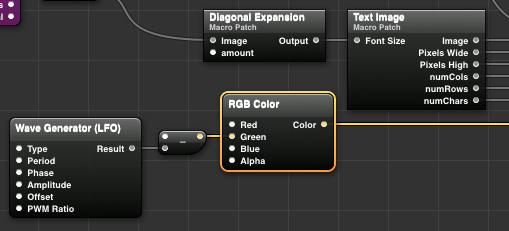

# ASCII Time
A mellow macOS screensaver for **cool** hackers. It displays the current date and time with a slowly strobing ASCII background that is generated from a random stock macOS background image found in `/Library/Desktop Pictures/`.

## Install
Copy `ASCII Time.qtz` to `~/Library/Screen Savers/`

## Preview

## Tweaking
Open `ASCII Time.qtz` in Quartz Composer and fiddle to your heart's content.

### Quick walkthrough

1. Select patch
2. Click **Patch Inspector**
3. Change parameters

- Change ASCII color from the **RGB Color** patch.
- Change character size from the **Diagonal Expansion** patch.
- Change strobe behaviour from **Wave Generator (LFO)** patch.

